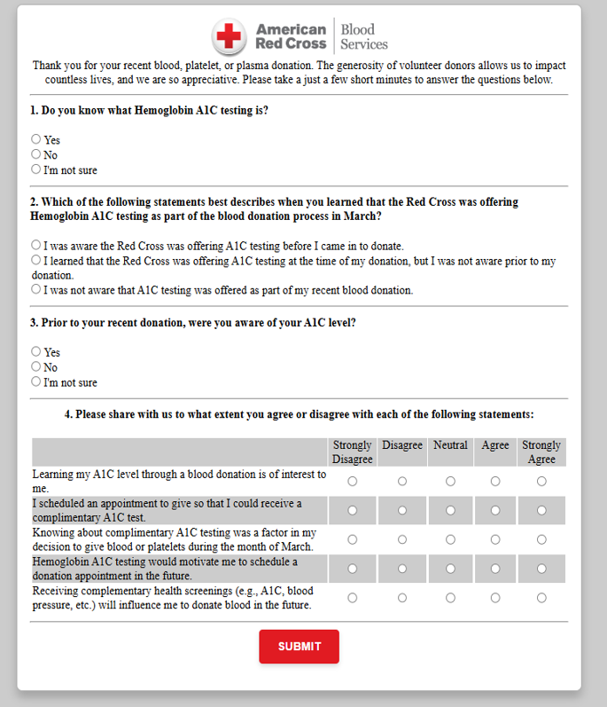

```{r setup, include=FALSE}
knitr::opts_chunk$set(echo = TRUE)
```

## **Analysis of donor responses to questionnaire survey after 03'2025 A1c Testing** {.tabset .tabset-fade .tabset-pills}
### Data{.tabset}
#### Survey example
```{r pressure, echo=FALSE, fig.cap="Survey Example", out.width = '100%'}

```

#### Sample responses
```{r class.source = 'fold-hide', warning=FALSE,  message=FALSE, results='show', echo=FALSE}
library(pacman)
pacman::p_load(readxl, dplyr, gtsummary,gt, ggplot2, wesanderson,conflicted,DT, trace = F)
conflict_prefer("filter", "dplyr")
conflict_prefer("select", "dplyr")
survy <- read_excel("E:\\ARC\\Projects\\A1C\\SurveyDataApril.xlsx")
survy <- survy %>% mutate(
  age_group = case_when(Age < 30 ~ "-29",
                        Age >= 30 & Age <55 ~ "30-55",
                        Age >= 55 ~ "55-")
)
survy$Q1 <- factor(survy$Q1, levels = c("Yes", "No", "Unsure"))
survy$Q3 <- factor(survy$Q3, levels = c("Yes", "No", "Unsure"))
survy$Q4 <- factor(survy$Q4, levels = c("Strongly Agree", "Agree", "Neutral", "Disagree", "Strongly Disagree"))
survy$Q5 <- factor(survy$Q5, levels = c("Strongly Agree", "Agree", "Neutral", "Disagree", "Strongly Disagree"))
survy$Q6 <- factor(survy$Q6, levels = c("Strongly Agree", "Agree", "Neutral", "Disagree", "Strongly Disagree"))
survy$Q7 <- factor(survy$Q7, levels = c("Strongly Agree", "Agree", "Neutral", "Disagree", "Strongly Disagree"))
survy$Q8 <- factor(survy$Q8, levels = c("Strongly Agree", "Agree", "Neutral", "Disagree", "Strongly Disagree"))


survy$Q5rev <-  if_else(survy$Q2 %in% "Aware Prior to Donation", survy$Q5, NA)
survy$Q6rev <-  if_else(survy$Q2 %in% "Aware Prior to Donation", survy$Q6, NA)

datatable(head(survy,9), options = list(pageLength=50, scrollX='400px'), filter = 'top')                        
```

### Analysis{.tabset .active}
#### Table 1 
```{r class.source = 'fold-hide', warning=FALSE,  message=FALSE, results='show'}

survy %>% tbl_summary(by = age_group,
                      include = c(Q1, Q2, Q3, Q4, Q5rev, Q6rev, Q7, Q8),
                      label = list(Q1 = "Q1. Do you know what Hemoglobin A1C testing is?",
                                   Q2 = "Q2. When did you learned that the ARC was offering 
                                   HbA1C testing in March?",
                                   Q3 = "Q3. Prior to your recent donation were you aware of your A1C level?",
                                   Q4 = "Q4. Learning my A1C level through a blood donation is of interest to me.",
                                   Q5rev = "Q5*. I scheduled an appointment to give so that I could receive a complimentary A1C test.",
                                   Q6rev = "Q6*. Knowing about complimentary A1C testing was a factor in my decision to donate blood in March.",
                                   Q7 = "Q7. Hemoglobin A1C testing would motivate me to schedule a donation appointment in the future.",
                                   Q8 = "Q8. Receiving complementary health screenings will influence me to donate blood in the future."
                      ), missing = "no"
                      # value = list(
                                    # Q1 = "Yes",
                                    # Q2 = "Yes",
                                    # Q3 = "Yes",
                                    # Q4 = "Yes",
                                    # Q5 = "Yes",
                                    # Q6 = "Yes",
                                    # Q7 = "Yes",
                                    # Q8 = "Yes")
                      )%>% remove_row_type(variables = c(Q5rev, Q6rev), type = "missing") %>%
  modify_spanning_header(all_stat_cols() ~ "**Age-Groups**") %>%
  modify_header(label = "**Survey Questions**", p.value = "**P**") %>%
  modify_header(all_stat_cols() ~ "**{level}**, N = {n} ({style_percent(p)}%)") |>
    add_p() %>% modify_caption("**Analysis of donor responses to questionnaire survey after 03'2025 A1c Testing**") |> 
  modify_table_styling(columns = label, rows = label == "Q5*. I scheduled an appointment to give so that I could receive a complimentary A1C test.",
                       footnote = "*among donors who were aware of the A1c testing prior to donation in March") %>%
  modify_table_styling(columns = label, rows = label == "Q6*. Knowing about complimentary A1C testing was a factor in my decision to donate blood in March.", footnote = "*among donors who were aware of the A1c testing prior to donation in March") %>%
  bold_labels() 
```

#### Bar-plots {.tabset}
##### Q1
```{r class.source = 'fold-hide', warning=FALSE,  message=FALSE, results='show',fig.width=13, fig.height=6, out.width="100%", out.height="100%"}
survy$Q1 <- factor(survy$Q1, levels = c("Yes", "No", "Unsure"))
df <- survy %>% filter(Gender != "") %>%
  group_by(Gender,age_group,Q1) %>%
  summarise(counts = n()) %>% 
  mutate(percent = round(counts/sum(counts), digits = 2))
remove(p)
p <- ggplot(df, aes(x = age_group, y = percent)) + 
  geom_bar(
    aes(fill = reorder(Q1, desc(Q1))),
    stat = "identity", position = position_dodge(0.8),
    width = 0.7
  )  + facet_wrap(~Gender) + coord_flip() 
p +  geom_text(aes(label=paste0(counts," (", 100*percent,"%)"), 
                   group = reorder(Q1, desc(Q1))), 
               position = position_dodge(0.8), 
               hjust = 1, size = 4.5, angle = 0) + 
  scale_fill_manual(values=rev(wes_palette(n=4, name="Zissou1")), 
                    # breaks = c("Yes", "No", "Unsure"),
                    guide = guide_legend(reverse = TRUE)
  ) + theme(axis.title = element_text(size = 13, face = )) + theme(text = element_text(size = 15))+
  scale_y_continuous(labels = scales::percent) +
  # theme(axis.text.y = element_blank()) +
  labs(y = "percent of donors responding", x ="donor age-group", fill="response") + 
  guides(color = guide_legend(title = "New Species Title"))+
  # scale_y_discrete(breaks = NULL) +
  ggtitle("Q1. Do you know what Hemoglobin A1C testing is?") + theme(legend.position = "right")

# BottleRocket1, BottleRocket2, Rushmore1, Royal1, Royal2, Zissou1, Darjeeling1, Darjeeling2, 
# Chevalier1 , FantasticFox1 , Moonrise1, Moonrise2, Moonrise3, Cavalcanti1, GrandBudapest1, 
# GrandBudapest2, IsleofDogs1, IsleofDogs2, FrenchDispatch, AsteroidCity2, 
# AsteroidCity2, AsteroidCity3
```

##### Q2
```{r class.source = 'fold-hide', warning=FALSE,  message=FALSE, results='show',fig.width=12, fig.height=6, out.width="100%", out.height="100%"}
survy$Q2 <- factor(survy$Q2, levels = c("Aware Prior to Donation", "Learned at Donation", "Unaware"))
df <- survy %>% filter(Gender != "") %>%
  group_by(Gender,age_group,Q2) %>%
  summarise(counts = n()) %>% 
  mutate(percent = round(counts/sum(counts), digits = 2))
remove(p)
p <- ggplot(df, aes(x = age_group, y = percent)) + 
  geom_bar(
    aes(fill = reorder(Q2, desc(Q2))),
    stat = "identity", position = position_dodge(0.8),
    width = 0.7
  )  + facet_wrap(~Gender) + coord_flip() 
p +  geom_text(aes(label=paste0(counts," (", 100*percent,"%)"), 
                   group = reorder(Q2, desc(Q2))), 
               position = position_dodge(0.8), 
               hjust = 0.9, size = 4.5, angle = 0) + 
  scale_fill_manual(values=rev(wes_palette(n=3, name="Zissou1")), 
                    # breaks = c("Yes", "No", "Unsure"),
                    guide = guide_legend(reverse = TRUE)
  ) + theme(axis.title = element_text(size = 13, face = )) + theme(text = element_text(size = 15))+
  scale_y_continuous(labels = scales::percent) +
  # theme(axis.text.y = element_blank()) +
  labs(y = "percent of donors responding", x ="donor age-group", fill="response") + 
  guides(color = guide_legend(title = "New Species Title"))+
  # scale_y_discrete(breaks = NULL) +
  ggtitle("Q2. When did you learned that the ARC was offering HbA1C testing in March?")+ theme(legend.position = "right")
```


##### Q3
```{r class.source = 'fold-hide', warning=FALSE,  message=FALSE, results='show',fig.width=12, fig.height=6, out.width="100%", out.height="100%"}
survy$Q3 <- factor(survy$Q3, levels = c("Yes", "No", "Unsure"))
df <- survy %>% filter(Gender != "") %>%
  group_by(Gender,age_group,Q3) %>%
  summarise(counts = n()) %>% 
  mutate(percent = round(counts/sum(counts), digits = 2))
remove(p)
p <- ggplot(df, aes(x = age_group, y = percent)) + 
  geom_bar(
    aes(fill = reorder(Q3, desc(Q3))),
    stat = "identity", position = position_dodge(0.8),
    width = 0.7
  )  + facet_wrap(~Gender) + coord_flip() 
p +  geom_text(aes(label=paste0(counts," (", 100*percent,"%)"), 
                   group = reorder(Q3, desc(Q3))), 
               position = position_dodge(0.8), 
               hjust = 0.6, size = 4.5, angle = 0) + 
  scale_fill_manual(values=rev(wes_palette(n=4, name="Zissou1")), 
                    # breaks = c("Yes", "No", "Unsure"),
                    guide = guide_legend(reverse = TRUE)
  ) +  theme(axis.title = element_text(size = 13, face = )) + theme(text = element_text(size = 15))+
  scale_y_continuous(labels = scales::percent) +
  # theme(axis.text.y = element_blank()) +
  labs(y = "percent of donors responding", x ="donor age-group", fill="response") + 
  guides(color = guide_legend(title = "New Species Title"))+
  # scale_y_discrete(breaks = NULL) +
  ggtitle("Q3. Prior to your recent donation were you aware of your A1C level?")+ theme(legend.position = "right")

# BottleRocket1, BottleRocket2, Rushmore1, Royal1, Royal2, Zissou1, Darjeeling1, Darjeeling2, 
# Chevalier1 , FantasticFox1 , Moonrise1, Moonrise2, Moonrise3, Cavalcanti1, GrandBudapest1, 
# GrandBudapest2, IsleofDogs1, IsleofDogs2, FrenchDispatch, AsteroidCity2, 
# AsteroidCity2, AsteroidCity3
```


##### Q4
```{r class.source = 'fold-hide', warning=FALSE,  message=FALSE, results='show',fig.width=12, fig.height=6, out.width="100%", out.height="100%"}
survy$Q4 <- factor(survy$Q4, levels = c("Strongly Agree", "Agree", "Neutral", "Disagree", "Strongly Disagree"))
df <- survy %>% filter(Gender != "") %>%
  group_by(Gender,age_group,Q4) %>%
  summarise(counts = n()) %>% 
  mutate(percent = round(counts/sum(counts), digits = 2))
remove(p)
p <- ggplot(df, aes(x = age_group, y = percent)) + 
  geom_bar(
    aes(fill = reorder(Q4, desc(Q4))),
    stat = "identity", position = position_dodge(0.8),
    width = 0.7
  )  + facet_wrap(~Gender) + coord_flip() 
p +  geom_text(aes(label=paste0(counts," (", 100*percent,"%)"), 
                   group = reorder(Q4, desc(Q4))), 
               position = position_dodge(0.8), 
               hjust = "auto", size = 4.5, angle = 0) + 
  scale_fill_manual(values=rev(wes_palette(n=5, name="Zissou1")), 
                    # breaks = c("Strongly Agree", "Agree", "Neutral", "Disagree", "Strongly Disagree"),
                    guide = guide_legend(reverse = TRUE)
  ) +  theme(axis.title = element_text(size = 13, face = )) + theme(text = element_text(size = 15))+
  scale_y_continuous(labels = scales::percent) +
  # theme(axis.text.y = element_blank()) +
  labs(y = "percent of donors responding", x ="donor age-group", fill="response") + 
  guides(color = guide_legend(title = "New Species Title"))+
  # scale_y_discrete(breaks = NULL) +
  ggtitle("Q4. Learning my A1C level through a blood donation is of interest to me.")+ theme(legend.position = "right")

```


##### Q5
```{r class.source = 'fold-hide', warning=FALSE,  message=FALSE, results='show',fig.width=12, fig.height=6, out.width="100%", out.height="100%"}
survy$Q5 <- factor(survy$Q5, levels = c("Strongly Agree", "Agree", "Neutral", "Disagree", "Strongly Disagree"))
df <- survy %>% filter(Gender != "" & Q2 == "Aware Prior to Donation" ) %>%
  group_by(Gender,age_group,Q5) %>%
  summarise(counts = n()) %>% 
  mutate(percent = round(counts/sum(counts), digits = 2))
remove(p)
p <- ggplot(df, aes(x = age_group, y = percent)) + 
  geom_bar(
    aes(fill = reorder(Q5, desc(Q5))),
    stat = "identity", position = position_dodge(0.8),
    width = 0.7
  )  + facet_wrap(~Gender) + coord_flip() 
p +  geom_text(aes(label=paste0(counts," (", 100*percent,"%)"), 
                   group = reorder(Q5, desc(Q5))), 
               position = position_dodge(0.8), 
               hjust = 1, size = 4.5, angle = 0) + 
  scale_fill_manual(values=rev(wes_palette(n=5, name="Zissou1")), 
                    # breaks = c("Strongly Agree", "Agree", "Neutral", "Disagree", "Strongly Disagree"),
                    guide = guide_legend(reverse = TRUE)
  ) + theme(axis.title = element_text(size = 13, face = )) + theme(text = element_text(size = 15))+
  scale_y_continuous(labels = scales::percent) +
  # theme(axis.text.y = element_blank()) +
  labs(y = "percent of donors responding", x ="donor age-group", fill="response", 
       subtitle = "(among donors who were aware of the A1c testing prior to donation)") + 
  guides(color = guide_legend(title = "New Species Title"))+
  # scale_y_discrete(breaks = NULL) +
  ggtitle("Q5. I scheduled an appointment to give so that I could receive a complimentary A1C test.")

```


##### Q6 
```{r class.source = 'fold-hide', warning=FALSE,  message=FALSE, results='show',fig.width=12, fig.height=6, out.width="100%", out.height="100%"}
survy$Q6 <- factor(survy$Q6, levels = c("Strongly Agree", "Agree", "Neutral", "Disagree", "Strongly Disagree"))
df <- survy %>% filter(Gender != "" & Q2 == "Aware Prior to Donation" ) %>%
  group_by(Gender,age_group,Q6) %>%
  summarise(counts = n()) %>% 
  mutate(percent = round(counts/sum(counts), digits = 2))
remove(p)
p <- ggplot(df, aes(x = age_group, y = percent)) + 
  geom_bar(
    aes(fill = reorder(Q6, desc(Q6))),
    stat = "identity", position = position_dodge(0.8),
    width = 0.7
  )  + facet_wrap(~Gender) + coord_flip() 
p +  geom_text(aes(label=paste0(counts," (", 100*percent,"%)"), 
                   group = reorder(Q6, desc(Q6))), 
               position = position_dodge(0.8), 
               hjust = 1, size = 4.5, angle = 0) + 
  scale_fill_manual(values=rev(wes_palette(n=5, name="Zissou1")), 
                    # breaks = c("Strongly Agree", "Agree", "Neutral", "Disagree", "Strongly Disagree"),
                    guide = guide_legend(reverse = TRUE)
  ) + theme(axis.title = element_text(size = 13, face = )) + theme(text = element_text(size = 15))+
  scale_y_continuous(labels = scales::percent) +
  # theme(axis.text.y = element_blank()) +
  labs(y = "percent of donors responding", x ="donor age-group", fill="response", 
       subtitle = "(among donors who were aware of the A1c testing prior to donation)") + 
  guides(color = guide_legend(title = "response"))+
  # scale_y_discrete(breaks = NULL) +
  ggtitle("Q6. Knowing about complimentary A1C testing was a factor in my decision to donate blood in March.") 
  
```


##### Q7
```{r class.source = 'fold-hide', warning=FALSE,  message=FALSE, results='show',fig.width=12, fig.height=6, out.width="100%", out.height="100%"}
survy$Q7 <- factor(survy$Q7, levels = c("Strongly Agree", "Agree", "Neutral", "Disagree", "Strongly Disagree"))
# reorder(Q7, desc(Q7))
df <- survy %>% filter(Gender != "") %>%
  group_by(Gender,age_group,Q7) %>%
  summarise(counts = n()) %>% 
  mutate(percent = round(counts/sum(counts), digits = 2))
remove(p)
p <- ggplot(df, aes(x = age_group, y = percent)) + 
  geom_bar(
    aes(fill = reorder(Q7, desc(Q7))),
    stat = "identity", position = position_dodge(0.8),
    width = 0.7
  )  + facet_wrap(~Gender) + coord_flip() 
p +  geom_text(aes(label=paste0(counts," (", 100*percent,"%)"), 
               group = reorder(Q7, desc(Q7))), 
               position = position_dodge(0.8), 
               hjust = 1, size = 4.5, angle = 0) + 
  scale_fill_manual(values=rev(wes_palette(n=5, name="Zissou1")), 
                    # breaks = c("Strongly Agree", "Agree", "Neutral", "Disagree", "Strongly Disagree"),
                    guide = guide_legend(reverse = TRUE)
                    ) + theme(axis.title = element_text(size = 13, face = )) + theme(text = element_text(size = 15))+
  scale_y_continuous(labels = scales::percent) +
  # theme(axis.text.y = element_blank()) +
  labs(y = "percent of donors responding", x ="donor age-group", fill="response") + 
  guides(color = guide_legend(title = "response"))+
  # scale_y_discrete(breaks = NULL) +
  ggtitle("Q7. Hemoglobin A1C testing would motivate me to schedule a donation appointment in the future.")
```


##### Q8 
```{r class.source = 'fold-hide', warning=FALSE,  message=FALSE, results='show',fig.width=12, fig.height=6, out.width="100%", out.height="100%"}
survy$Q8 <- factor(survy$Q8, levels = c("Strongly Agree", "Agree", "Neutral", "Disagree", "Strongly Disagree"))
df <- survy %>% filter(Gender != "") %>%
  group_by(Gender,age_group,Q8) %>%
  summarise(counts = n()) %>% 
  mutate(percent = round(counts/sum(counts), digits = 2))
remove(p)
p <- ggplot(df, aes(x = age_group, y = percent)) + 
  geom_bar(
    aes(fill = reorder(Q8, desc(Q8))),
    stat = "identity", position = position_dodge(0.8),
    width = 0.7
  )  + facet_wrap(~Gender) + coord_flip() 
p +  geom_text(aes(label=paste0(counts," (", 100*percent,"%)"), 
                   group = reorder(Q8, desc(Q8))), 
               position = position_dodge(0.8), 
               hjust = 1, size = 4.5, angle = 0) + 
  scale_fill_manual(values=rev(wes_palette(n=5, name="Zissou1")), 
                    # breaks = c("Strongly Agree", "Agree", "Neutral", "Disagree", "Strongly Disagree"),
                    guide = guide_legend(reverse = TRUE)
  ) + theme(axis.title = element_text(size = 13, face = )) + theme(text = element_text(size = 15)) +
  scale_y_continuous(labels = scales::percent) +
  # theme(axis.text.y = element_blank()) +
  labs(y = "percent of donors responding", x ="donor age-group", fill="response") + 
  guides(color = guide_legend(title = "New Species Title"))+
  # scale_y_discrete(breaks = NULL) +
  ggtitle("Q8. Receiving complementary health screenings will influence me to donate blood in the future.")
```

### Conclusion {.tabset}
* About **43%** of younger donors vs. **70%** of middle-aged or **71%** of the older donors knew what A1c testing is.
* Only about 11-12% of younger donors (29 or younger), and about 32%-33% of middle aged donors, and 39-42% of 55+ donors were aware of their A1c level prior to donation
* Only about half of the 50+ donors were aware of the complimentary A1c testing prior to donation
* Of those who were aware of the complimentary A1c testing and **disagreed** that complimentary A1c testing was a factor in their decision to donate blood, about **23% agreed** that receiving complementary health screenings in future will influence them to donate blood in the future.
* Of those who were aware of the complimentary A1c testing and were **neutral** about complimentary A1c testing as a factor in their decision to donate blood, about **49% agreed** that receiving complementary health screenings in future will influence them to donate blood in the future.
